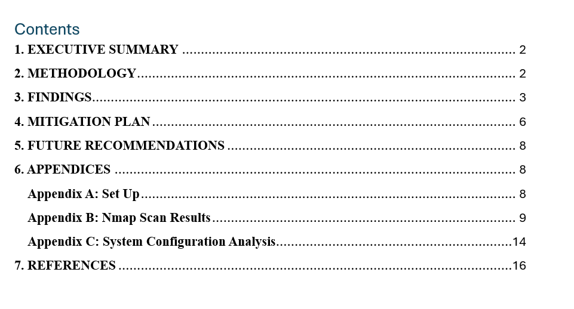
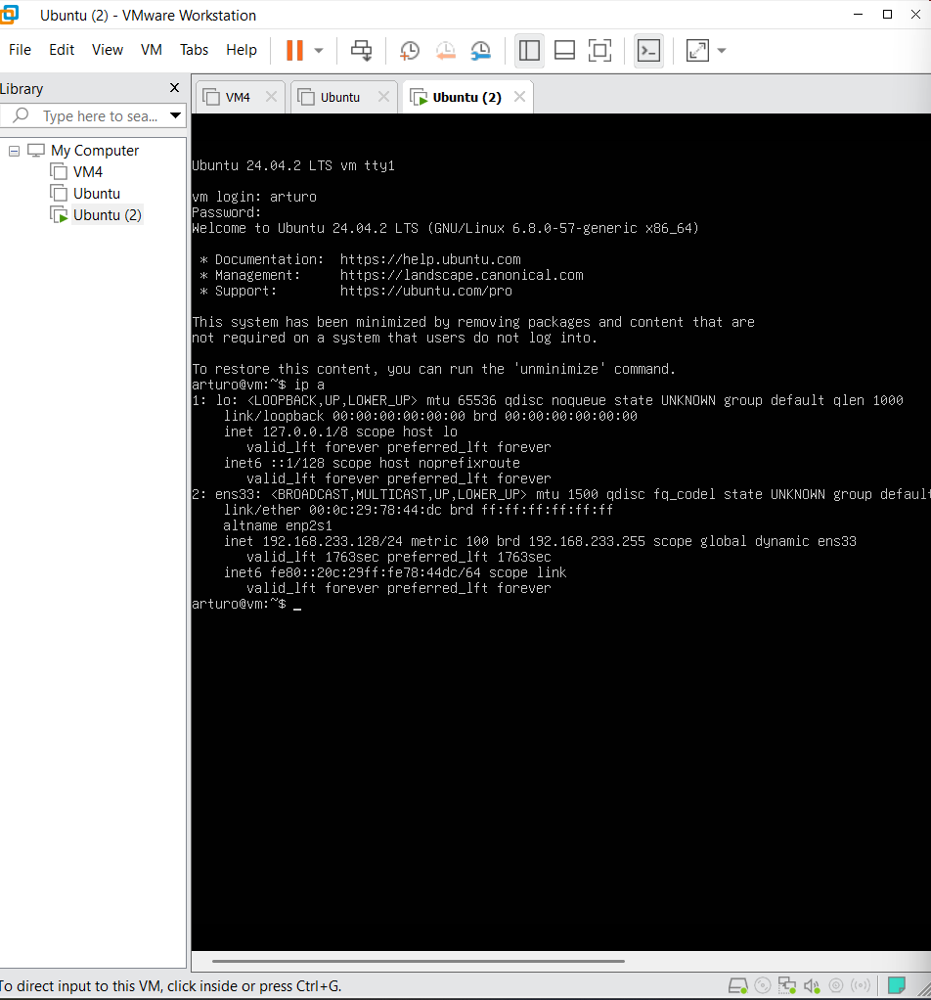
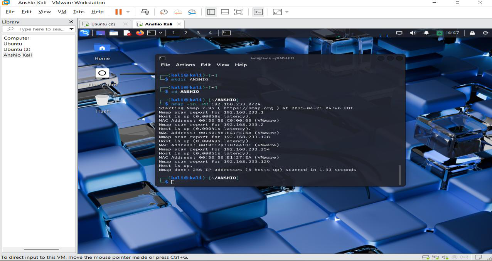

# Network Vulnerability Assessment — DNS and DHCP Server (VM-4)


-red?style=for-the-badge)

> **Module:** Communications and Networking Security (B9CY103), Dublin Business School
> **Client scenario:** Technovia Solutions | **Target:** VM-4, DNS and DHCP server, `192.168.233.128`
> A grey-box vulnerability assessment of a Linux server, producing 20 documented findings of
> which 5 were Critical, delivered as a prioritised written remediation plan.

---

## Overview

DNS translates names into addresses and DHCP hands out addresses to machines joining a network.
Between them they determine who can reach what, which makes a server running both a high-value
target. This assessment evaluated the security posture of a server designated for those two roles.

The approach was **grey box**: external scanning from a Kali attacker machine combined with
authorised login to the target for configuration review. That combination is what makes the
findings defensible. A port scan tells you what is exposed; reading the configuration tells you
why, and lets you separate a genuine misconfiguration from a scanner artefact.

---

## Methodology

**Scanning, from the outside**

```bash
nmap -sS <target>                              # SYN scan for port discovery
nmap -sV <target>                              # service version detection
nmap -O  <target>                              # OS fingerprinting
nmap -A  <target>                              # scripted comprehensive scan
nmap --script vuln <target>                    # vulnerability scripts
nmap --script dns <target>                     # DNS-specific checks
nmap --script broadcast-dhcp-discover          # DHCP discovery
nmap --script smb <target>                     # SMB enumeration
```

**Verification, from the inside**

Direct login to confirm configuration files, verify which services were genuinely running,
review system configuration and examine running processes.

---

## Headline finding

**The server designated as the DNS and DHCP server was running neither service.**

The configuration files were present, so the machine appeared configured, but the services were
absent. It was therefore failing completely at the only job it existed to perform, while still
sitting on the network presenting an attack surface. Network clients depending on it could not
obtain addresses automatically.

---

## Findings summary

| Severity | Count |
|----------|-------|
| Critical | 5 |
| High | 10 |
| Medium | 5 |
| **Total** | **20** |

Findings are identified `VULN-001` through `VULN-020`, each carrying a description, severity,
supporting evidence, risk and impact, and a specific remediation.

**Representative issues**

| ID | Service / Port | Issue | Severity |
|----|----------------|-------|----------|
| VULN-001 | DNS (53) | DNS service absent on the designated DNS server | Critical |
| VULN-002 | DHCP (67/68) | DHCP service absent, clients cannot obtain addresses | Critical |
| VULN-003 | DNS (53) | Insecure zone transfer configuration | Critical |
| VULN-004 | Multiple | Excessive unnecessary open ports and services | High |
| VULN-006 | SMB (139/445) | Samba running without required message signing | High |
| VULN-007 | IRC (6666) | IRC service on a dedicated DNS and DHCP server | High |
| VULN-008 | Config management | Leftover `.dpkg-new` files, configuration never applied | High |
| VULN-010 | Kerberos (4444) | KRB524 service running without proper configuration | High |

The pattern across the findings is a single machine carrying far more than its role requires. An
infrastructure server had IRC, Samba file sharing, a Kerberos service, and PostgreSQL and Redis
database services, none of which belong there. Every additional service is another way in.

---

## Remediation delivered

Each finding carries a specific fix rather than generic advice, for example:

- **VULN-003, insecure zone transfer:** restrict `allow-transfer` to authorised servers by IP
  range and add access controls in the BIND configuration
- **VULN-004, excessive open ports:** apply `ufw default deny incoming`, then disable and remove
  services not required by the server's role
- **VULN-006, SMB signing:** set `server signing = mandatory` in `/etc/samba/smb.conf` and
  restrict SMB access to authorised networks

Forward-looking recommendations covered role-based server architecture limiting each server to
its designated function, network segmentation with defined security zones, infrastructure as
code for consistent builds, and regular audits.

---

## Why the report was the deliverable

The scanning was the quick part. What the assignment was assessed on was the written output: a
prioritised plan with reasoning attached to every finding, so that whoever picks it up knows
what to fix first and why it matters, without needing to talk to the person who ran the scan.

---

## Limitations, stated honestly

This was a vulnerability assessment, not a penetration test. Findings were identified and
evidenced but not exploited, and no attempt was made to chain them into a compromise. The scope
was a single host in a controlled environment provided for the assignment.

---


## Screenshots

Selected screenshots captured during the assessment. The full walkthrough with every screenshot is in the report under `docs/`.








*The remaining 4 screenshots are in the `screenshots/` folder.*


---

## Repository contents

- `docs/` — the full assessment report, including the findings table, evidence appendices and
  Nmap output
